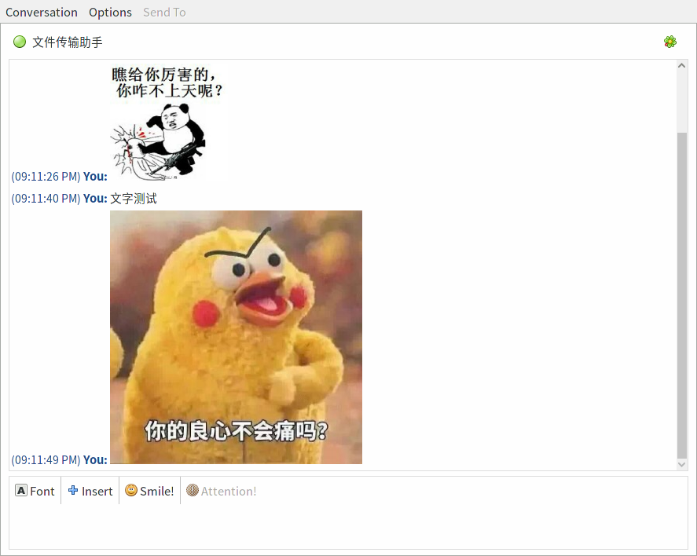

# Pidgin-wechat
`pidgin-wechat` 是一个使用微信网页版接口和 `pidgin/libpurle` IM 框架的**第三方桌面版微信程序**的实现。目前支持联系人聊天、群聊天等功能，并支持图片消息的接收。可以运行在所有 `Pidgin` 支持的平台上(Linux, Windows, MacOS)。

## 截图
 


## 构建
使用 `Cargo` 可以很方便的构建本项目。
```
cargo build --release
```

### 编译依赖
- libpurple-dev

> 依赖有可能未完全列出，仅在 Archlinux 系统、 nightly 的 rust 编译器下编译通过。

> 也可以在 [Releases](https://github.com/sbwtw/pidgin-wechat/releases/) 中下载编译好的二进制文件。

## 安装
如果使用 `cargo`，编译好的二进制文件在 `target/release` 目录下。

`pidgin` 的插件只需要把对应的库文件拷贝到插件目录，重新运行 `pidgin` 即可。
```
mkdir -p ~/.purple/plugins
cp -f libwechat.so ~/.purple/plugins/
```

## 项目进展
目前还在技术验证阶段，暂时实现了基本的登录和消息的收发（图片仅接收），下一步准备支持用户头像。

## 开发进度
- [x] 登录
- [x] 收发文字消息
- [x] 收发群聊天消息（Bugs: [#1](https://github.com/sbwtw/pidgin-wechat/issues/1) [#2](https://github.com/sbwtw/pidgin-wechat/issues/2)）
- [x] 接收图片消息
- [x] 接收自定义表情
- [ ] 发送文件与图片
- [ ] 用户头像
- [ ] 公众号
- [ ] 接收富文本消息
- [ ] 接收语音消息
- [ ] 内置表情
- [ ] 系统级别的消息提醒

## Hack
目前遇到最多的问题是：
- 登录失败，此时终端会输出很多 1101 字样的消息，重新登录即可，常出现在短时间重复登录。
- 接收消息时崩溃（无新消息响应），容易在网络环境较差的时候出现，目前没有实现重传机制，需要重新登录。

可以使用 `cargo build` 来生成 debug 版本的库文件，在 `target/debug/` 目录下。

pidgin-wechat 的日志目前是输出到标准输出上的，可以在终端中启动 pidgin，就可以看到日志。

如果遇到崩溃问题，可以使用 `coredumpctl -1 info pidgin` 来输出 pidgin 的 core dump 信息（确保安装了 systemd 的 coredump 相关包），这将对定位问题十分有用。如果没有 coredump，请使用 `gdb` 获取相关信息。

### 目录结构
```
.
├── Cargo.lock
├── Cargo.toml
├── purple-sys                                      libpurple 接口的 codegen 目录，生成 rust-ffi 接口
│   ├── build.rs
│   ├── Cargo.lock
│   ├── Cargo.toml
│   ├── README.md
│   ├── src
│   │   ├── lib.rs
│   │   └── purple.rs
│   └── TODO.md
├── README.md
├── screenshot
│   ├── 2017-04-13-211208_887x708_scrot.png
│   └── 2017-04-13-211409_302x579_scrot.png
└── src
    ├── chatroom.rs                                 群组信息的 struct
    ├── pointer.rs                                  一个 C raw pointer 的 wrapper
    ├── server.rs                                   核心文件，wechat 服务通讯相关的代码
    ├── user.rs                                     用户信息的 struct
    └── wechat.rs                                   核心文件，实现 purple 接口的代码
```

## Q&A
### 为什么使用 Pidgin/libpurple
当前的桌面版 Wechat 实现已经很多了，并且界面更加现代化。但由于 pidgin/libpurple 对许多聊天协议都有支持，维护这个插件的主要目的在于能够在统一的平台上完成所有 IMs 的登录，不需要再登录 N 多个聊天工具。

### 是否支持红包/表情包的显示
由于数据是基于微信网页版协议的，所以像网页版没有开放的这些功能，理论上都无法实现。

## 协议
